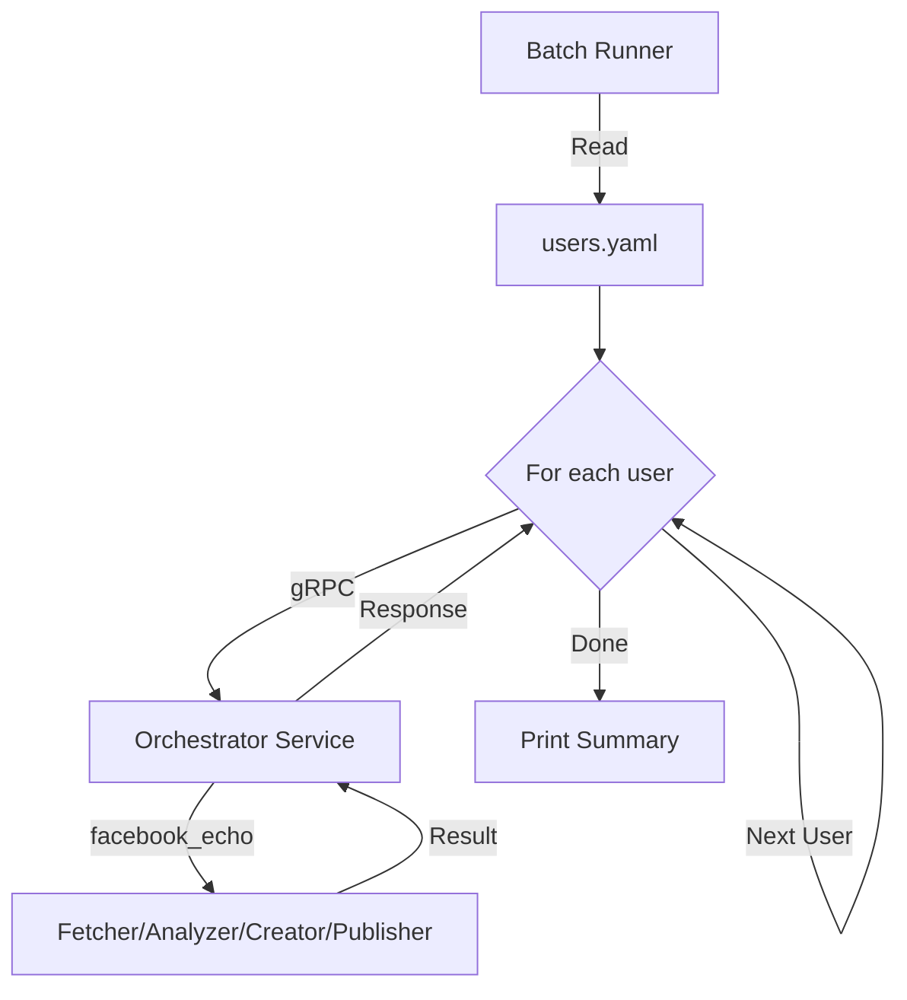

# 03 - Multi-User Pipeline Execution

## Background
Currently, the Facebook Echo Bot requires manual invocation with credentials passed via CLI flags for each user/page. This doesn't scale when managing multiple Facebook pages.

The user wants to:
- Define multiple users (Facebook pages) in a configuration file
- Run pipelines for all users automatically
- Avoid manual CLI invocation for each page

## Problem Statement
We need a scalable way to:
1. Store credentials for multiple Facebook pages
2. Execute pipelines sequentially or in parallel for all pages
3. Handle errors gracefully (one page failure shouldn't stop others)
4. Track execution results per page

## Questions and Answers

**Q: What file format should we use?**
A: **YAML** is more human-friendly for configuration. Proposal:
```yaml
users:
  - name: "Health Tips Page"
    platform: facebook
    page_id: "123456789"
    access_token: "EAABs..."
    pipelines:
      - facebook_echo
  - name: "Finance Page" 
    platform: facebook
    page_id: "987654321"
    access_token: "EAABs..."
    pipelines:
      - facebook_echo
```

**Q: Where should this file live?**
A: **Root project level**: `/Users/george/Documents/SideProjects/users.yaml`
- Easy to find
- One source of truth for all services
- Can be gitignored for security

**Q: Should pipelines run sequentially or in parallel?**
A: **Sequential for MVP**, with option for parallel in future.
- Easier to debug
- Avoids rate limiting issues
- Clear logs per user

**Q: How should errors be handled?**
A: **Continue on error** (fail-graceful).
- One page failure shouldn't block others
- Log errors per user and provide summary at end

**Q: Should this integrate with the Identity service?**
A: **No, keep separate for MVP**.
- Identity service is for internal user management
- Social platform credentials are external integrations
- May integrate later for OAuth token refresh

**Q: What component should read the file and orchestrate?**
A: **Create a new CLI tool**: `cmd/batch-runner`
- Reads `users.yaml`
- Calls Orchestrator service for each user
- Independent from existing clients

**Q: Should we support multiple platforms (Twitter, LinkedIn)?**
A: **Yes, design should be platform-agnostic**.
- File format supports `platform` field
- Orchestrator already supports multiple flows
- Future-proof for other platforms

## Design

### File Format: `users.yaml`

```yaml
version: "1.0"
users:
  - id: "user-001"                    # Internal identifier
    name: "Health & Wellness Page"    # Human-readable name
    platform: facebook                # Platform type
    credentials:
      page_id: "123456789"
      access_token: "EAABs..."
    pipelines:
      - name: facebook_echo
        enabled: true
        
  - id: "user-002"
    name: "Financial Advice Page"
    platform: facebook
    credentials:
      page_id: "987654321"
      access_token: "EAACs..."
    pipelines:
      - name: facebook_echo
        enabled: true
```

### Batch Runner Architecture

**File**: `orchestrator/cmd/batch-runner/main.go`

```go
type Config struct {
    Version string `yaml:"version"`
    Users   []User `yaml:"users"`
}

type User struct {
    ID          string            `yaml:"id"`
    Name        string            `yaml:"name"`
    Platform    string            `yaml:"platform"`
    Credentials map[string]string `yaml:"credentials"`
    Pipelines   []Pipeline        `yaml:"pipelines"`
}

type Pipeline struct {
    Name    string `yaml:"name"`
    Enabled bool   `yaml:"enabled"`
}

func main() {
    // 1. Load users.yaml
    // 2. Connect to Orchestrator gRPC
    // 3. For each user:
    //    - For each enabled pipeline:
    //      - Call orchestrator.RunPipeline(flow_name, params=credentials)
    //      - Log result
    // 4. Print summary
}
```

### Execution Flow



## Implementation Plan

### Phase 1: Configuration Schema
- [ ] Define `users.yaml` schema
- [ ] Create example file with comments
- [ ] Add `.gitignore` entry for security

### Phase 2: Batch Runner
- [ ] Create `orchestrator/cmd/batch-runner/main.go`
- [ ] Implement YAML loading (`gopkg.in/yaml.v3`)
- [ ] Implement orchestrator client connection
- [ ] Implement sequential execution loop

### Phase 3: Error Handling & Logging
- [x] Add per-user error tracking
- [x] Generate execution summary (success/fail counts)
- [x] Add structured logging (JSON or table format)

### Phase 4: Rate Limit Handling
- [x] Add delay between users in `cmd/batch-runner`
- [x] Respect Gemini API free tier limits (5-15 RPM)

### Phase 5: Testing
- [x] Test with multiple fake users (mock)
- [ ] Test with 2 real Facebook pages
- [x] Verify error handling (invalid token)

## Examples

### ✅ Good: Structured error handling
```go
type ExecutionResult struct {
    UserID   string
    UserName string
    Pipeline string
    Status   string // "success", "failed"
    Error    error
    PostURL  string
}

results := []ExecutionResult{}
for _, user := range config.Users {
    result := ExecutionResult{UserID: user.ID, UserName: user.Name}
    res, err := runPipeline(user)
    if err != nil {
        result.Status = "failed"
        result.Error = err
    } else {
        result.Status = "success"
        result.PostURL = res.OutputUrls[0]
    }
    results = append(results, result)
}
```

### ❌ Bad: Fail on first error
```go
for _, user := range users {
    if err := runPipeline(user); err != nil {
        log.Fatal(err) // Stops entire batch
    }
}
```

## Trade-offs

### Chosen Approach: YAML + Sequential Execution
**Pros:**
- YAML is human-friendly
- Sequential is easier to debug
- Clear error isolation per user
- Simple to implement

**Cons:**
- YAML parsing adds dependency
- Sequential is slower than parallel
- Credentials in plaintext (mitigated by gitignore)

### Alternative: Database Storage
Could store users in Postgres (via Identity service).
**Rejected for MVP** because:
- Adds complexity
- Requires database schema changes
- YAML is simpler for 2-5 pages

### Alternative: Parallel Execution
Use goroutines to run users in parallel.
**Deferred to Phase 2** because:
- Sequential is safer for rate limits
- Easier to trace logs
- Can add `--parallel` flag later

## Verification Plan

### Automated Tests
- Unit test: YAML parsing with valid/invalid files
- Unit test: Error handling logic

### Manual Verification
1. Create `users.yaml` with 2 test pages
2. Run `go run cmd/batch-runner/main.go`
3. Verify:
   - Both pages processed
   - Logs show clear per-user execution
   - Summary printed at end
4. Test error case: One invalid token
   - Verify: Failed user logged, other user still processed

## User Review Required

> [!IMPORTANT]
> **Decision Points for User:**
> 1. **File Location**: Is `/Users/george/Documents/SideProjects/users.yaml` acceptable? **✅ APPROVED**
> 2. **File Format**: Does the proposed YAML structure meet your needs? **✅ APPROVED**
> 3. **Sequential Execution**: Is sequential execution acceptable for MVP (can parallelize later)? **✅ APPROVED**
> 4. **Plaintext Credentials**: Acceptable if `users.yaml` is gitignored? (Production would use vault/env vars) **✅ APPROVED**

## Implementation Results

### 1. Configuration Files

**File**: [`users.yaml.example`](file:///Users/george/Documents/SideProjects/users.yaml.example)

Created example configuration with detailed comments:
- Template for 2 users with all required fields
- Inline documentation for finding Page ID and generating tokens
- References to `FACEBOOK_SETUP.md` for detailed instructions

**File**: [`.gitignore`](file:///Users/george/Documents/SideProjects/.gitignore)

Added security protection:
```
users.yaml  # Prevents accidental commit of credentials
```

### 2. Batch Runner Implementation

**File**: [`orchestrator/cmd/batch-runner/main.go`](file:///Users/george/Documents/SideProjects/orchestrator/cmd/batch-runner/main.go)

**Features Implemented**:
- YAML configuration loading via `gopkg.in/yaml.v3`
- Sequential execution loop with timeout (120s per pipeline)
- Per-user error tracking with continue-on-failure
- Detailed logging with progress indicators
- Execution summary with success/failure counts
- Duration tracking per pipeline

**Key Functions**:
- `loadConfig()`: Parses YAML into Go structs
- `executePipeline()`: Executes single pipeline for single user
- `printSummary()`: Generates formatted execution report

### 3. Error Handling

**Fail-Graceful Design**:
- One user failure does NOT stop batch execution
- Each result tracked separately
- Summary shows all failures at end
- Exit code 1 if any failures occurred

**Example Output**:
```
===== Execution Summary =====
Total: 4 pipelines
✅ Success: 3
❌ Failed: 1
⏭️  Skipped: 0

Detailed Results:
--------------------------------------------------
✅ [success] Health & Wellness Page - facebook_echo (12.34s)
   Post: http://mock-social-media.com/mock-post-id-12345
❌ [failed] Financial Advice Page - facebook_echo (5.67s)
   Error: rpc error: code = Unknown desc = fetch failed: meta api error [190]: Invalid OAuth access token
--------------------------------------------------
```

### 4. Usage

**Step 1**: Create `users.yaml` from template
```bash
cd /Users/george/Documents/SideProjects
cp users.yaml.example users.yaml
# Edit users.yaml with your actual credentials
```

**Step 2**: Start services
```bash
docker-compose up
```

**Step 3**: Run batch processor
```bash
cd orchestrator
go run cmd/batch-runner/main.go
# Or use custom config path:
go run cmd/batch-runner/main.go -config=/path/to/users.yaml
```

### 5. Command-Line Flags

- `-config`: Path to YAML config (default: `../../users.yaml`)
- `-orchestrator`: Orchestrator address (default: `localhost:50056`)

### 6. Build & Deploy

**Compile binary**:
```bash
cd orchestrator
go build -o batch-runner ./cmd/batch-runner
./batch-runner
```

**Future**: Could be packaged as Docker container or cron job for automated execution.


